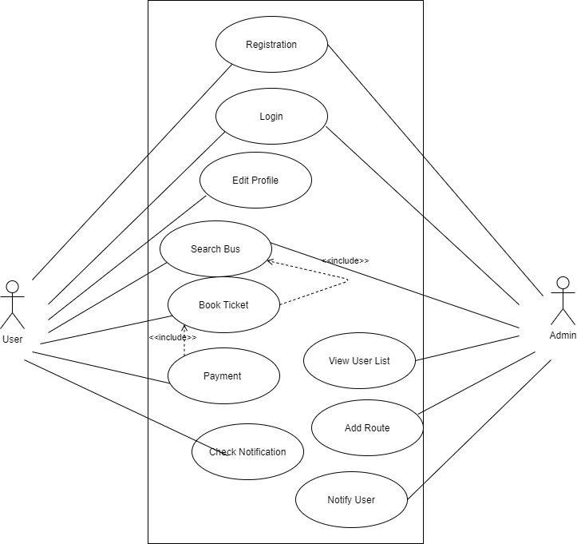
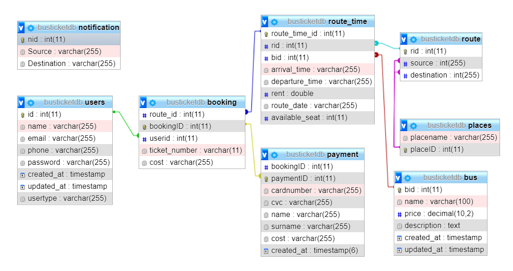

# Bus Ticket Booking Android App

The bus ticket booking system is a mobile-based application that will help users by providing all the information including schedule, routes, timing, ticket price and seat availability of a bus in a particular area. To see the information about a bus, users need to select the area. 

# Requirement
Install [Android Studio](https://developer.android.com/studio)
Install [WAMP Server](http://www.wampserver.com/en/) or [XAMPP Server](https://www.apachefriends.org/download.html)

# To run =>
1. Create a database in XAMPP or WAMP server named **busticketdb**
3. Import and run the **busbooking.sql** file in the created database of xampp server.
4. Place the **busbooking** folder from php backend folder in **htdocs of xampp**.
5. Open and Run the **BusTicketBookingAdminPanel** app in android studio
6. Username and password of admin is admin@admin.com and password 123456
7. Open and Run the BusTicketBooking app in android studio
8. Username and password of default user is lamisharawshan@gmail.com and password 123456

# Use Case Diagram
	

# Database Schema

